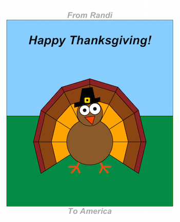
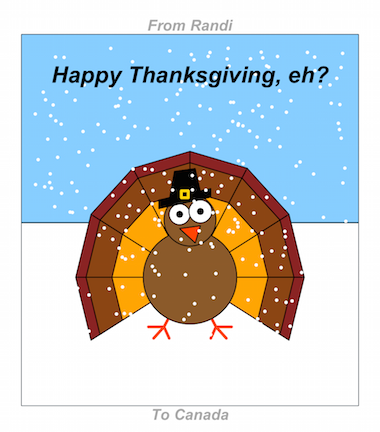
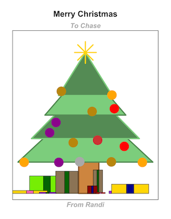
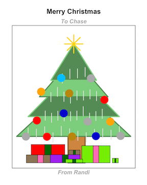
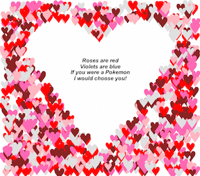

<br>
[<-- Back to Projects](../projects.html)
<br>
<a target="_blank" href="https://github.com/rgriff23/caRds">Go to GitHub --></a>

___

### Thanksgiving

`TurkeyDay` creates a Thanksgiving turkey:

```
TurkeyDay(from = "Randi", to = "America")
```



Wish Canada a happy Canadian Thanksgiving with `canadian = TRUE`:

```
TurkeyDay(from = "Randi", to = "Canada", canadian = TRUE)
```



___

### Christmas

`ChristmasTree` generates a jolly tree with presents underneath:

```
ChristmasTree(from = "Randi", to = "Chase", numPresents = 10)
```



Add tinsel with `tinsel = TRUE`. 

```
ChristmasTree(from = "Randi", to = "Chase", numPresents = 10, tinsel = TRUE)
```



___

### Valentine's Day

`OneThousandHearts` sprinkles 1000 tiny hearts about a larger heart, creating negative heart space where a romantic message can be included. If you use the `to` argument to specify the recipient of your Valentine's Day caRd, a simple message will be generated automatically:

```
OneThousandHearts(to = "Samara")
```


Alternatively, use `lines` to include a personalized message up to 4 lines long:

```
OneThousandHearts(line1 = "Roses are red", 
  line2 = "Violets are blue", 
  line3 = "If you were a Pokemon", 
  line4 = "I would choose you!")
```



___

[<-- Back to Projects](http://rgriff23.github.io/projects.html)

