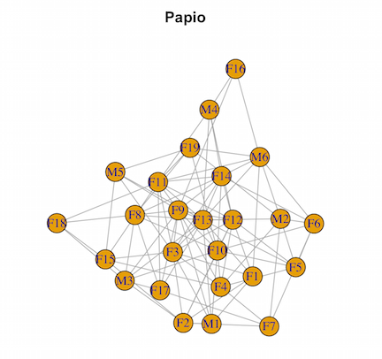
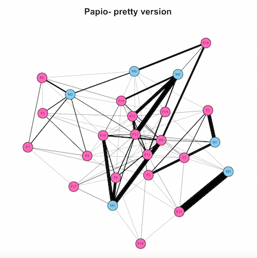
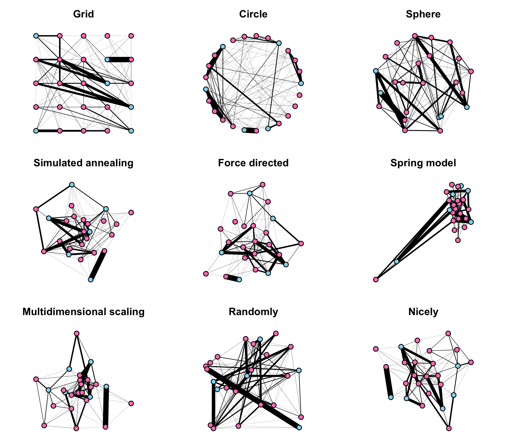
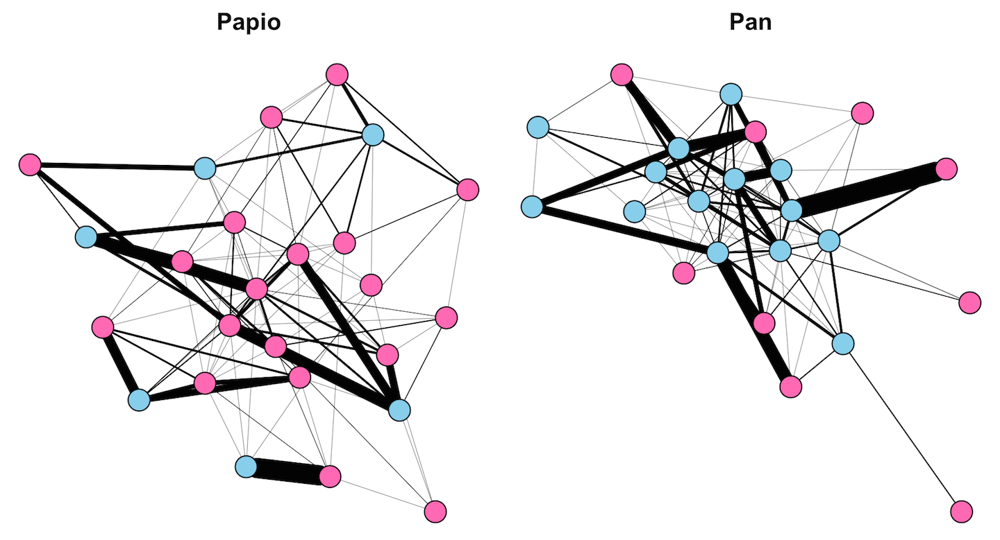
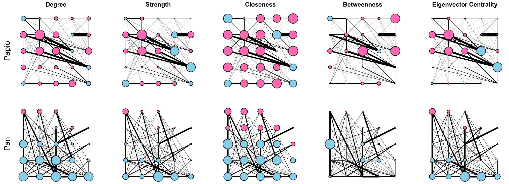

<br>
[<-- Back to Projects](../projects.html)
<br>
[Go to GitHub -->](https://github.com/rgriff23/Primate_social_networks)

___

Years ago, as an undergrad, my first ever science project was a comparative study of primate social networks and parasite transmission. It was also my first experience coding: I used Matlab and Mathematica. Since then, I've transitioned to doing virtually all of my stats in R, and I decided it was time to learn how to do network anaysis in R. So I dug up a few primate social networks from my undergraduate thesis, installed `igraph` (Csardi & Nepusz, 2006), and started coding. The result is this tutorial! 

Before beginning, install the `igraph` package and load it into R:

```{r eval=FALSE}
library(igraph)
```

## Importing social network data into R

I've provided two primate social networks: one for baboons (*Papio papio*) and one for chimpanzees (*Pan troglodytes*). Both networks come from field studies on grooming interactions among troop members (Boese 1975; Arnold & Whiten, unpublished data). The networks are weighted and undirected, and the node labels indicate whether individuals are male or female (the chimpanzee data also indicates whether individuals are adult or juvenile, but we are going to ignore that information). The data are currently in the form of adjacency matrices in *.csv files, so we can read them into R like this:

```{r eval=FALSE}
Papio.adj <- read.csv("data/Papio_adjacency.csv", row.names=1)
Pan.adj <- read.csv("data/Pan_adjacency.csv", row.names=1)
```

The imported *.csv data are now in dataframes. We can convert them into `igraph` edgelists like this:

```{r eval=FALSE}
Papio.edges <- graph_from_adjacency_matrix(as.matrix(Papio.adj), mode="undirected", weighted=TRUE)
Pan.edges <- graph_from_adjacency_matrix(as.matrix(Pan.adj), mode="undirected", weighted=TRUE)
```

At its simplest, an edgelists is a matrix of two columns: one for "source" nodes and one for "sink" nodes. Each row of the edgelist matrix represents an edge in the network. Edgelists readily scale up to large sparse networks (>1000 nodes), and `igraph` allows you to add attributes to nodes or vertices that can then be harnessed for visualization or analysis.

## Visualization

Network visualiziation tools in `igraph` are very flexible. Here, I'll demonstrate some basic features and use them to compare sex differences in the social networks of *Pan* and *Papio*. 

We'll begin by focusing on the *Papio* network. Let's look at the most basic plot with all the default settings:

```{r eval=FALSE}
plot(Papio.edges, main="Papio")
```



But we can do better. Let's add colors to represent males and females, and edge weights to represent the strength of interactions among individuals. I'm going to be super gender normative and use blue for males and pink for females. In addition to coloring the vertices, I'll make a number of other aesthetic adjustments to the graph: reduce the size of vertices and vertex labels, and color edges black:

```{r eval=FALSE}
# Define vector of colors based on sex
pap.sexes <- vertex_attr(Papio.edges)$name
pap.sexes <- gsub("M[0-9]*", "skyblue", pap.sexes)
pap.sexes <- gsub("F[0-9]*", "hotpink", pap.sexes)

# Make plot
plot(Papio.edges, main="Papio- pretty version", vertex.color=pap.sexes, vertex.size=10, vertex.label.cex=0.5, edge.width=edge_attr(Papio.edges)$weight*0.25, edge.color="black")
```



There are many algorithms for placing nodes in the plot, some of which force the nodes into particular patterns, and others that try to spread nodes out in a meaningful, visually appealing way. The following 3 X 3 plot shows examples of many layout options available in `igraph`, and also illustrates how to add attributes to the graph object that will lead to automatically generated graphical parameters such as node and edge colors or weights. 

```{r eval=FALSE}
# Add attributes to new network, Papio.edges2
Papio.edges2 <- set.vertex.attribute(Papio.edges, "color", value=pap.sexes)
Papio.edges2 <- set.vertex.attribute(Papio.edges2, "size", value=10)
Papio.edges2 <- set.edge.attribute(Papio.edges2, "width", value=edge_attr(Papio.edges)$weight*0.1)
Papio.edges2 <- set.edge.attribute(Papio.edges2, "color", value="black")

# Plot window
layout(matrix(1:9, 3, 3, byrow=TRUE))
par(mar=c(1,0,3,0))

# Make plots
plot(Papio.edges2, main="Grid", layout=layout_on_grid, vertex.label=NA)
plot(Papio.edges2, main="Circle", layout=layout_in_circle, vertex.label=NA)
plot(Papio.edges2, main="Sphere", layout=layout_on_sphere, vertex.label=NA)
plot(Papio.edges2, main="Simulated annealing", layout=layout_with_dh, vertex.label=NA)
plot(Papio.edges2, main="Force directed", layout=layout_with_fr, vertex.label=NA)
plot(Papio.edges2, main="Spring model", layout=layout_with_kk, vertex.label=NA)
plot(Papio.edges2, main="Multidimensional scaling", layout=layout_with_mds, vertex.label=NA)
plot(Papio.edges2, main="Randomly", layout=layout_randomly, vertex.label=NA)
plot(Papio.edges2, main="Nicely", layout=layout_nicely, vertex.label=NA)
```



The default option is "nicely", which will apply a force-directed layout, and usually works pretty well. It attempts to do 5 things (Fruchterman & Reingold 1991):

1. Distribute vertices evenly in the frame
2. Minimize edge crossings
3. Make edge lengths uniform
4. Reflect inherent symmetry
5. Conform to the frame

This method generally makes the nodes and edges easy to see, although a potential downside is that the initial configuration of nodes in the force-directed algorithm is random, such that subsequent plots of the same network look different.

Now, let's do a comparison between the *Pan* and *Papio* networks (we'll have to define the color coding for sexes for *Pan*):

```{r eval=FALSE}
# Define vector of colors based on sex
pan.sexes <- vertex_attr(Pan.edges)$name
pan.sexes <- gsub("[A-D]M[0-9]*", "skyblue", pan.sexes)
pan.sexes <- gsub("[A-D]F[0-9]*", "hotpink", pan.sexes)

# Add attributes to Pan network
Pan.edges2 <- set.vertex.attribute(Pan.edges, "color", value=pan.sexes)
Pan.edges2 <- set.vertex.attribute(Pan.edges2, "size", value=10)
Pan.edges2 <- set.edge.attribute(Pan.edges2, "width", value=edge_attr(Pan.edges)$weight*0.0005)
Pan.edges2 <- set.edge.attribute(Pan.edges2, "color", value="black")

# Plot window
layout(matrix(1:2, 1, 2))
par(mar=c(0,0,2,0))

# Make plots
plot(Papio.edges2, main="Papio", vertex.label=NA)
plot(Pan.edges2, main="Pan", vertex.label=NA)
```



This plot reveals exactly what any primatologist would expect. The matriarchal baboons, *Papio*, have females at the center of the network, and females have numerous interactions with other females. In contrast, the relatively small number of *Papio* males are more peripheral, and there are few relationships between male baboons- rather, male grooming interactions are primarily with females. The patriarchal chimpanzees, *Pan*, have males at the center of the network, and males have many interactions among themselves. In contrast, female chimpanzees are peripheral and appear to interact exclusively with males rather than with each other. 

## Analysis

Network metrics fall into two major categories: 1) node or individual-level metrics, and 2) whole network-level metrics. Below, I briefly introduce and demonstrate how to compute some of the most common metrics used in social network analysis, and use them to make quantitative comparisons between the *Pan* and *Papio* social networks. 

### Individual level metrics

Individual-level metrics capture the relative "importance" of nodes in a network. There are many different metrics that have different properties, and their appropriateness depends on the research question. The simplest metric is "degree centrality", which is defined as the number of connections for a given node:

```{r eval=FALSE}
# Compute degree
pan.degree <- degree(Pan.edges)
papio.degree <- degree(Papio.edges)
```

A slightly more nuanced metric is "strength centrality", which is defined as the sum of the weights of all the connections for a given node. This is also sometimes called "weighted degree centrality".

```{r eval=FALSE}
# Compute strength
pan.strength <- strength(Pan.edges)
papio.strength <- strength(Papio.edges)
```

Closeness centrality is a measure of how far other nodes are from the node in question. Nodes with high closeness centrality are likely to be relatively efficient in receiving or transmitting information to/from distant parts of the social network.

```{r eval=FALSE}
# Weighted closeness
pan.closeness <- closeness(Pan.edges)
papio.closeness <- closeness(Papio.edges)
```

Betweenness measures the number of shortest paths between nodes in the network that go through the node in question. Nodes with relatively high betweenness are likely to be key conduits of information flow across a network, and their removal may have a large impact on spreading phenomena. 

```{r eval=FALSE}
# Weighted betweenness
pan.betweenness <- betweenness(Pan.edges)
papio.betweenness <- betweenness(Papio.edges)
```

Eigenvector centrality is defined as the values of the principal eigenvector for the network when represented as a matrix. Under this metric, a node's centrality score is proportional to the centrality scores of it's connections. 

```{r eval=FALSE}
# Eigenvector centrality
pan.eigencent <- eigen_centrality(Pan.edges)
papio.eigencent <- eigen_centrality(Papio.edges)
pan.eigencent <- pan.eigencent$vector
papio.eigencent <- papio.eigencent$vector
```

We can now compare how these different measures of centrality differ from each other and between our two primate networks. I'm going to use the grid layout for these plots because it has a consistent structure that maximizes space between the nodes, and I am plotting node sizes proportional to their centrality scores (normalizing them so that the largest centrality score always corresponds to a node size of 30). 

```{r eval=FALSE}
# Set grid layout attribute
Papio.edges3 <- set.graph.attribute(Papio.edges2, "layout", layout.grid)
Pan.edges3 <- set.graph.attribute(Pan.edges2, "layout", layout.grid)

# Plot networks with node size propotional to centrality
quartz()
layout(matrix(1:10, 2, 5, byrow = TRUE))
par(mar=c(0,2,2,0))
plot(Papio.edges3, vertex.label=NA, main="Degree", vertex.size=(30*papio.degree)/max(papio.degree))
mtext("Papio", side=2)
plot(Papio.edges3, vertex.label=NA, main="Strength", vertex.size=(30*papio.strength)/max(papio.strength))
plot(Papio.edges3, vertex.label=NA, main="Closeness", vertex.size=(30*papio.closeness)/max(papio.closeness))
plot(Papio.edges3, vertex.label=NA, main="Betweenness", vertex.size=(30*papio.betweenness)/max(papio.betweenness))
plot(Papio.edges3, vertex.label=NA, main="Eigenvector Centrality", vertex.size=(30*papio.eigencent)/max(papio.eigencent))
plot(Pan.edges3, vertex.label=NA, vertex.size=(30*pan.degree)/max(pan.degree))
mtext("Pan", side=2)
plot(Pan.edges3, vertex.label=NA, vertex.size=(30*pan.strength)/max(pan.strength))
plot(Pan.edges3, vertex.label=NA, vertex.size=(30*pan.closeness)/max(pan.closeness))
plot(Pan.edges3, vertex.label=NA, vertex.size=(30*pan.betweenness)/max(pan.betweenness))
plot(Pan.edges3, vertex.label=NA, vertex.size=(30*pan.eigencent)/max(pan.eigencent))
```



These plots show that in general, females tend to occupy more central positions in the *Papio* network, while males tend to occupy more central positions in the *Pan* network. These plots also make it clear that the different measures of centrality capture different features of network connectivity. It seems that degree, strength, and eigenvector centrality paint fairly similar pictures of "importance" in these networks, while closeness and betweenness are very different. Closeness does not vary much across either the *Pan* or *Papio* networks, reflecting the fact that in such small, dense networks, all nodes are close to all other nodes, and this measure may not be super informative. On the other hand, betweenness centrality identifies a small number of individuals as being important as "stepping stones" connecting different individuals in the network. In particular, one male in the *Pan* network stands out as having the highest betweenness centrality, even though that individual does not have very high degree, strength, or eigenvector centrality. 

### Network level metrics

Network-level metrics aim to capture something about the structure of the overall network. These metrics are related to emergent properties of the network, such as the efficiency of information flow or the vulnerability of the network to disturbances. Most network-level metrics relate to one of two intuitive features of network structure: 1) *centralization*, the extent to which a small number of nodes in the network are highly influential; and 2) *modularity*, the extent to which the network is comprised of highly connected subunits. 

### *Centralization*

Measures of network centralization correspond to individual-level centrality measures, and basically measure the extent to which social interactions are centered on the most central node in the network. Computation of centralization metrics involve:

1. Compute individual-level centrality measures
2. Sum the differences between the centrality score of the most central node and all other nodes
3. Normalize by dividing the sum from step 2 by the theoretical maximum sum for the maximally centralized network with the same number of nodes


### *Modularity*

Modularity analysis can either be hypothesis driven or exploratory. Hypothesis driven modularity analysis involves testing for the significance of an *a priori* division of the network into modules, while exploratory modularity analysis involves applying an optimization algorithm to identify modules in a network without an *a priori* hypothesis. 

## References

- Arnold & Whiten. *Unpublished data*.

- Boese, G.K. (1975). "Social Behavior and Ecological Considerations of West African Baboons (Papio papio)" in *Socioecology and Psychology of Primates*, P. 208

- Csardi G, Nepusz T. (2006). The igraph software package for complex network research, InterJournal, Complex Systems 1695. http://igraph.org

- Fruchterman, T.M.J. and Reingold, E.M. (1991). Graph Drawing by Force-directed Placement. Software - Practice and Experience, 21(11):1129-1164.


___

[<-- Back to Projects](http://rgriff23.github.io/projects.html)

